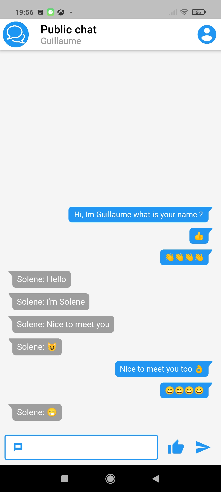
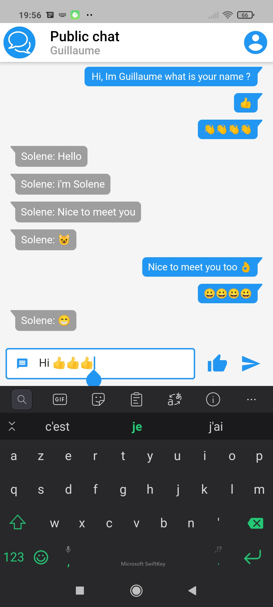
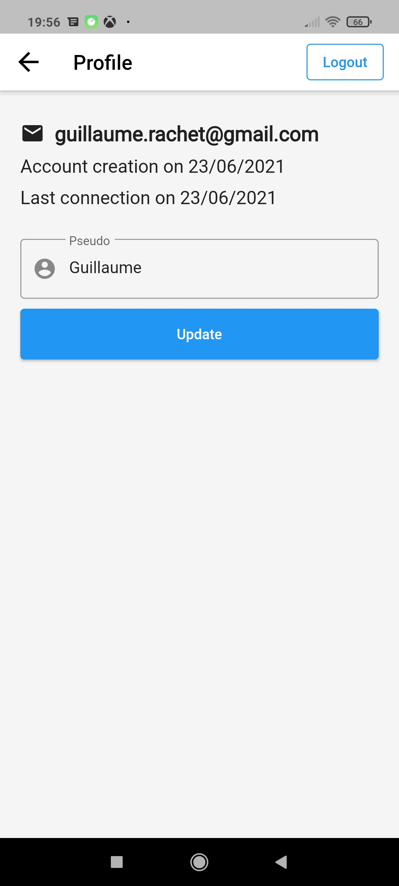
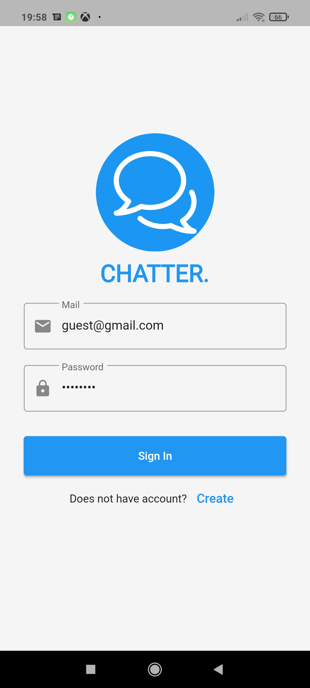
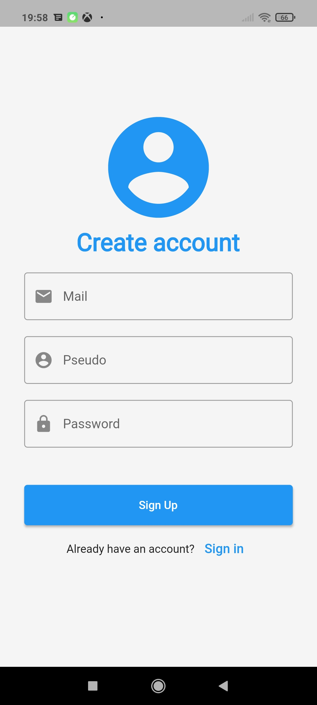

# Chatter

Messenger app in Flutter with only one public channel.

Functionnalities :

- send a message 
- Read everybody messages
- create account/login
- Change your pseudo 

<table> 
  <tr>
    <td></td>
    <td></td>
    <td></td>
  </tr>
 </table> 
 
 <table> 
  <tr>
    <td></td>
    <td></td> 
  </tr>
 </table> 

Dev :

- Flutter run
- Flutter build appbundle (must add key file)

